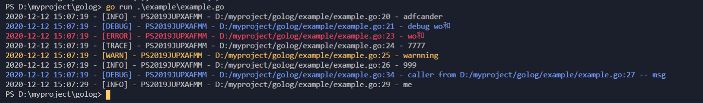

# golog
### 安装
```
 go get github.com/hyahm/golog
```

### 使用
> 在main 函数开始直接调用InitLogger方法  
```
package main

import (
	"time"

	"github.com/fatih/color"
	"github.com/hyahm/golog"
)

func main() {
	defer golog.Sync()
	// 第一个参数是设置日志目录 ， 如果为空，默认显示再控制台
	// 第二个参数是设置日志切割的大小，0 表示不按照大小切割， 默认单位M，
	//  第三个事是否每天切割，
	// 第四个是删除多少天以前的日志， 根据设置的name 来匹配， 0表示不删除
	// golog.InitLogger("log", 0, true, 1)
	golog.Level = golog.DEBUG
	debugColor := make([]color.Attribute, 0)
	debugColor = append(debugColor, color.FgBlue) // 前景色为蓝色
	golog.SetColor(golog.DEBUG, debugColor)       // 设置debug级别的日志颜色
	golog.Infof("adf%s", "cander")
	golog.Debug("debug wo和 ")
	golog.Level = golog.TRACE
	golog.Error("wo和 ")
	golog.Trace("7777")
	golog.Warn("warnning")
	golog.Info("999")
	aaa()
	time.Sleep(10 * time.Second)
	golog.Info("me")
	
}

func aaa() {
	golog.UpFunc(1, "msg")
}
```

控制台输出



